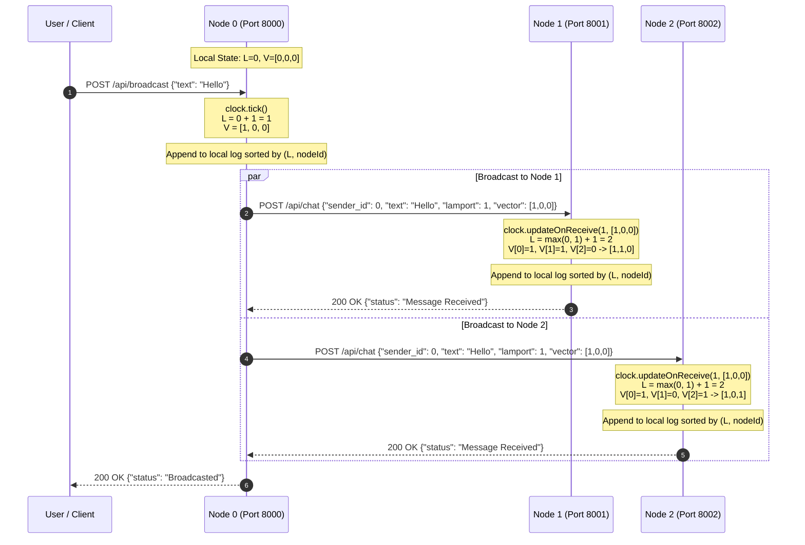
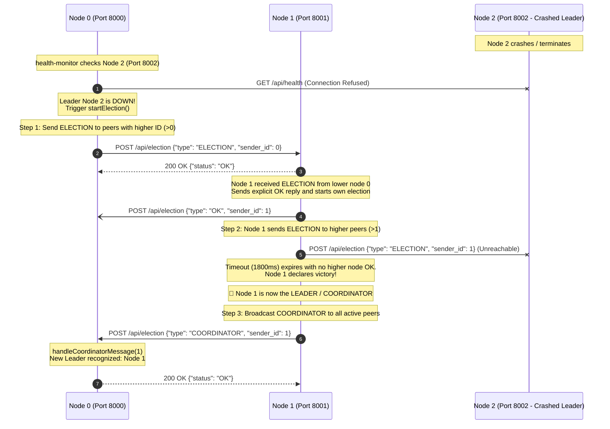
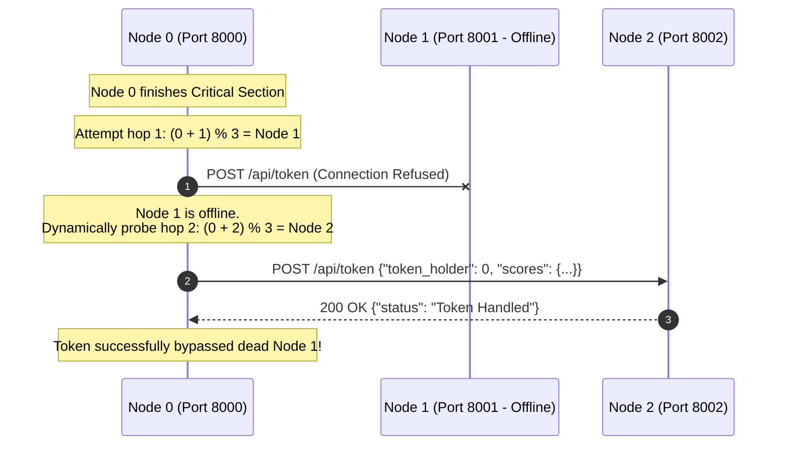

# UML Sequence Diagrams: Distributed Chat & Scoreboard System
**Course**: CSC 4722 – Distributed Systems  
**Evaluation Rubric v**: Accurate UML sequence diagrams [5 marks]

---

## 1. Logical Clock Chat Broadcast & Delivery Sequence

This sequence shows how Node 0 broadcasts a message, advancing its local Lamport and Vector clocks, and how recipient nodes (Node 1 and Node 2) update their clocks upon receiving the message:
$$L_{local} = \max(L_{local}, L_{incoming}) + 1$$
$$V_{local}[i] = \max(V_{local}[i], V_{incoming}[i]) \quad \forall i, \quad \text{and } V_{local}[local]++$$

---

## 2. Token Ring Mutual Exclusion & Shared Scoreboard Sequence

This sequence demonstrates mutual exclusion. Node 0 requests a score update (`wantsToUpdateScore = true`), which enters the critical section strictly upon receiving the circulating token. It applies the mutation and then safely passes the token around the ring.

```mermaid
sequenceDiagram
    autonumber
    participant U as Client
    participant N0 as Node 0 (Port 8000)
    participant N1 as Node 1 (Port 8001)
    participant N2 as Node 2 (Port 8002)

    U->>N0: POST /api/score {"player": "Alice", "points": 15}
    Note over N0: mutex.requestCriticalSection("Alice", 15)<br/>Enqueued in pendingUpdates<br/>(Awaiting token)
    N0-->>U: 200 OK {"status": "Queued for Critical Section"}

    Note over N2: Node 2 holds token
    N2->>N0: POST /api/token {"token_holder": 2, "scores": {"Alice": 0}}
    Note over N0: mutex.receiveToken()<br/>Merge incoming scoreboard
    
    rect rgb(30, 45, 60)
        Note over N0: ════ CRITICAL SECTION (MUTEX) ════<br/>De-queue "Alice" +15<br/>scoreboard.update("Alice", 15)<br/>Local Board: Alice = 15
    end

    Note over N0: Prepare Token Payload with updated scores
    N0->>N1: POST /api/token {"token_holder": 0, "scores": {"Alice": 15}}
    N1-->>N0: 200 OK {"status": "Token Handled"}
    Note over N0: hasToken = false

    Note over N1: Node 1 checks pending CS (none)<br/>Idle delay (350ms)
    N1->>N2: POST /api/token {"token_holder": 1, "scores": {"Alice": 15}}
    N2-->>N1: 200 OK {"status": "Token Handled"}
```

---

## 3. Bully Leader Election Algorithm on Node Failure

This sequence illustrates host failure detection via periodic `/api/health` polling, the initiation of the Bully election, and the coordinator announcement.

---

## 4. Fault-Tolerant Token Ring (Peer Skipping on Failure)

This sequence demonstrates dynamic skipping when a peer crashes. The token is never dropped or frozen.

